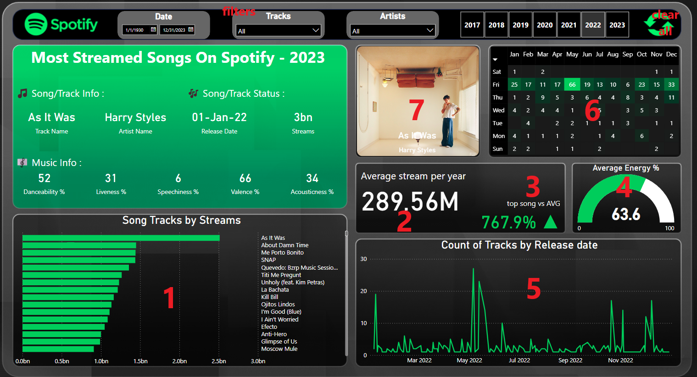

# 🟢🎵**Spotify Most Streamed Songs Analysis**🎵🟢

## 📝 Overview
This repository contains a comprehensive analysis of the "Most Streamed Spotify Songs 2023" dataset.

The analysis is performed using both Python and Power BI, providing valuable insights into the dynamics of popular songs on Spotify in 2023.

## 🧠 Analysis Approach

### 🧹 Data Cleaning and Wrangling

The first step involved cleaning and wrangling the raw dataset to prepare it for analysis. 

The Jupyter notebook [Data_Cleaning_&_Wrangling.ipynb](Data_Cleaning_&_Wrangling.ipynb) details the process, addressing issues such as character encoding, column selection, and data transformation.

A key challenge was handling character encoding discrepancies, which required a thorough approach to ensure data consistency.


## Python Script: Adding Album Art URLs
The Python script [Album_Art_Python.py](Album_Art_Python.py) demonstrates the addition of a new column, "album_art_url," to the dataset [updated-Art-spotify-2023.csv](updated-Art-spotify-2023.csv). Leveraging the Spotipy library,a lightweight Python library for the Spotify Web API. it searches for album art URLs based on track and artist information. 
This step contributes to enhancing the dataset with visual elements for potential future visualization or user interface improvements.

### Key points include:

1. Spotify API Credentials:
Obtain API credentials from the Spotify Developer Dashboard.
Visit the [Spotify Developer Dashboard](https://developer.spotify.com/) to create a new app and acquire the client ID and client secret.

2. Initialization:
Initialize Spotipy with Spotify API credentials.

```
# Replace 'your_client_id' and 'your_client_secret' with your actual credentials
client_credentials_manager = SpotifyClientCredentials(client_id='your_client_id', client_secret='your_client_secret')
sp = spotipy.Spotify(client_credentials_manager=client_credentials_manager)
```

3. Searching for Album Art: A function, get_album_art, is defined to search for album art URLs based on the track name and artist.

```
results = sp.search(q=f'track:{track_name} artist:{artist_name}', type='track')
Updating the DataFrame:
```
4. Updating the DataFrame: The script reads the cleaned dataset, iterates through each row, and applies the get_album_art function. The obtained album art URLs are then added to a new column, "album_art_url."

```
df['album_art_url'] = df.apply(lambda row: get_album_art(row['track_name'], row['artist(s)_name']), axis=1)
```

5. Saving the Updated DataFrame: The final step involves saving the updated DataFrame to a new CSV file, ensuring that the "album_art_url" column is now a part of the dataset.
```
output_file = '_with_art.csv'
df.to_csv(output_file, index=False)

```

## Power BI Visualizations

The Power BI file [Main_Spotify_project.pbix](Main_Spotify_project.pbix) showcases a variety of visualizations derived from the cleaned dataset. 


Notable visualizations include:

1. - **Stacked Bar Chart:** Displays the song tracks stacked by streams, providing a quick overview of the most streamed tracks.
2. - **Average Streams per Year Card:** Utilizing a DAX calculation (Average_Streams_Per_Year), this card presents the average streams per year, offering insights into overall streaming trends.
3. - **Top Song vs. Average Card:** Another DAX-driven card (Top_Song_vs_Average) compares the top song's streams against the average, providing context for a song's popularity.
4. - **Energy Percentage Gauge:** A gauge visualization indicates the average energy percentage of the songs in the dataset.
5. - **Tracks by Release Date Line Chart:** Depicts the count of tracks released over time, allowing for a temporal analysis of song releases.
6. - **Day of the Week vs. Month Matrix:** A matrix view presents a grid of days of the week against months, showing the count of tracks for each combination.
7. - **Album Art Display:** Utilizes a downloaded custom visual named [HTML content link]("https://appsource.microsoft.com/en-us/product/power-bi-visuals/wa200001930?tab=overview") to showcase album art for a more visually appealing representation of the data.

### DAX Codes

In the Power BI file, various DAX (Data Analysis Expressions) calculations were employed. A few snippets include:


#### Average Streams per Year:

```
Average_Streams_Per_Year = AVERAGE('Table'[Streams])
```
#### Top Song vs. Average:

```
Copy code
Top_Song_vs_Average = SUM('Table'[Top_Song_Streams]) - [Average_Streams_Per_Year]
```

## Challenges Faced
The character encoding issues posed a notable challenge during data cleaning, necessitating a careful approach to ensure the integrity of the dataset. Additionally, incorporating album art URLs required overcoming difficulties in extracting this information from the Spotify API using Spotipy.

## ℹ️ Dataset Source
The initial raw dataset is downloaded in CSV format from [Kaggle.com](https://www.kaggle.com/). The dataset is stored in the file [spotify-2023.csv](spotify-2023.csv).

## Somethig Extra
This readme.md provides a comprehensive overview of the Spotify Songs Analysis project, covering data cleaning, Power BI visualizations, challenges faced, and future improvements. The structure is clear and follows McKinsey's Pyramid Principle, presenting high-level information first.